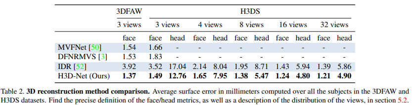

# H3D-Net-reproduction
The goal of this blog post is to present and describe our implementation to reproduce the deep learning paper “H3D-Net: Few-Shot High-Fidelity 3D Head Reconstruction” using Pytorch. We are doing this for an assignment of the course CS4240 Deep Learning (2021/22 Q3) at Delft University of Technology. This paper introduces a new high-fidelity full 3D head reconstruction method called H3D-Net that outperforms state-of-the-art models, such as MVFNet, DFNRMVS and IDR, in the few-shot (3 views) scenario. The H3D-Net utilizes both DeepSDF (a learned shape prior) and IDR (fine-tuning details) to achieve fast high-fidelity 3D face reconstruction from 2D images with different views. Please check the papers for more background information about DeepSDF and IDR. Our approach attempts to reproduce the results of the last two rows of "Table 2: 3D Reconstruction Method Comparison" of the paper.

Paper 1 describing IDR method: https://lioryariv.github.io/idr/  
Paper 2 describing DeepSDF method: https://paperswithcode.com/paper/deepsdf-learning-continuous-signed-distance  
Paper 3 describing H3D-Net method: https://crisalixsa.github.io/h3d-net/  

Repository 1 for IDR method: https://github.com/lioryariv/idr

Repository 2 for DeepSDF method: 

Repository 3 for H3D-Net method: Source code is not available, only the code used to manipulate the H3DS Dataset has been supplied

# Reproducibility Approach

In order to reproduce the results from Table 2, we will first start by implementing the IDR method as described in Paper 1 using the H3DS dataset. We believe this will take a considereable amount of time to implement due to the large amount of training needed. Each scan_id (person's head) needs to be trained on for 3, 4, 8, 16, 32 views. The results from this implementation should give us the second last row of Table 2.
Once implemented we will move on to the DeepSDF method described in paper 2, followed by the actual H3D-Net implementation. 

One thing to note is that by the end of this reproducibility project we will have reimplemented methods described in 3 different papers, which is a condsidereable amount of work given the short amount of time allocated. (4-5 weeks).
 
# IDR Method

The IDR method source code has been supplied and can be found in Repository 1, however it is taylored to the DTU dataset. So a few modiciations were needed in order to use the H3DS Dataset. 

