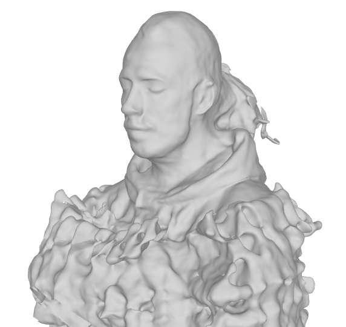

# H3D-Net-Reproduction
The goal of this blog post is to present and describe our implementation to reproduce the deep learning paper “H3D-Net: Few-Shot High-Fidelity 3D Head Reconstruction” using Pytorch. We are doing this for an assignment of the course CS4240 Deep Learning (2021/22 Q3) at Delft University of Technology. This paper introduces a new high-fidelity full 3D head reconstruction method called H3D-Net that outperforms state-of-the-art models, such as MVFNet, DFNRMVS and IDR, in the few-shot (3 views) scenario. The H3D-Net utilizes both DeepSDF (a learned shape prior) and IDR (fine-tuning details) to achieve fast high-fidelity 3D face reconstruction from 2D images with different views. Please check the papers for more background information about DeepSDF and IDR. Our approach attempts to reproduce the results of the last two rows of "Table 2: 3D Reconstruction Method Comparison" of the paper shown below.


### Paper 1 - IDR method: 
Paper: https://arxiv.org/pdf/2003.09852.pdf  
Repository: https://github.com/lioryariv/idr  

### Paper 2 - DeepSDF method: 
Paper: https://arxiv.org/pdf/1901.05103v1.pdf  
Repository: https://github.com/facebookresearch/DeepSDF  
               
### Paper 3 - H3D-Net method: 
Paper: https://arxiv.org/pdf/2107.12512v1.pdf  
Repository: https://github.com/CrisalixSA/h3ds  

The actual code implementation for the H3D-Net method is not available, the repository listed above is only for the H3DS dataset manipulation. 

## Introduction
Learning 3D reconstructed shapes from 2D images is a fundamental computer vision problem. A recent successful neural network approach to solving this problem involves the use of a (neural) differentiable rendering system along with a choice of 3D geometry representation include point clouds, triangle meshes, implicit representations defined over voxel grids, and neural implicit representations. We will now disucss the current research and state-of-the-art 3D rendering methods.

### 1. Neural Radiance Field (NeRF)
The NeRF algorithm represents a scene using a fully-connected deep neural network, whose input is a single continuous 5D coordinate (spatial location (x,y,z) and viewing direction (θ,ϕ)) and whose output is the volume density and view-dependent emitted radiance at that spatial location [^1]. The viewsare synthesized by querying 5D coordinates along camera rays and use volume rendering techniques to project the output colors and densities into an image.


*Figure 1: NeRF*  


### 2. Implicit surface Differentiable Renderer (IDR)
The IDR algorithm is a neural network architecture that simultaneously learns the following three unknowns: (1) the geometry of the scene, represented by parameters $\theta$; (2) the unknown camera parameters, represented by $\tau$; (3) and the light and reflectance properties from the surface towards the camera approximated surface rendering technique [^2], represented by $\gamma$. 


*Figure 2: IDR Architecture*  
c = camera position, v = viewing direction, x = surface point, n = normal to the surface

The IDR consists of implicit neural representattion network and neural renderer network, as shown in Figure 2. The intersection point $\hat x(\theta,\tau)$ as input shown as grey blocks is represented as $x(\theta,\tau)=c+t(\theta,c,v)v$, where $v$ denotes the unkonwn center of the camera and $v$ denotes the direction of ray. In order to obtain optimum points fits the shape of object, a gradient descent-like algorithm is implemented by representing intersection of the geometry surface $S_\theta$ and the ray $R(\tau)$ by the formula
$$
\hat x(\theta,\tau)=c+t_0v-\frac{v}{\nabla_xf(x_0;\theta_0)\cdot v_0}f(c+t_0v,\theta).
$$

To reach an optimum solution by iteration, we apply a loss function on mini-batches, denoted by $P$. Let $I_p$ be the RGB and mask values of a pixel $p$ in mini-batches of an image. The loss function consists of RGB loss, mask loss and Eikonal loss, as shown below:
$$
loss(\theta,\gamma,\tau)=loss_{RGB}(\theta,\gamma,\tau)+\rho loss_{MASK}(\theta,\tau)+\lambda loss_{Eik}(\theta)
$$
where $\rho$ and $\lambda$ are the weights of mask loss and Eikonal loss respectively. The implicit neural representation network is implemented using signed distance funstion (approximated by $f$) with Implicit Geometric Regularization (IGR)[^3], i.e., applying Eikonal regularization:
$$
loss_{Eik}(\theta)=\mathbb{E}_x(||\nabla_xf(x;\theta)||-1)^2
$$
where x is distributed uniformly in the bounding space of the scene. Let $L_p(\theta,\gamma,\tau)$ be the rendereed color of image $I_p$, the RGB loss is
$$
loss_{RGB}(\theta,\gamma,\tau)=\frac{1}{|P|}\sum_{p\in P^{in}}|I_P-L_P(\theta,\gamma,\tau)|,
$$
where $|\cdot|$ represents the $L_1$ norm. The indices of mini-batches without ray-geometry intersection can be denoted by $P^{out}=P\backslash P^{in}$. The mask loss is
$$
loss_{MASK}(\theta,\tau)=\frac{1}{\alpha |P|}\sum_{p\in P^{out}}CE(O_p,S_{p,\alpha}(\theta,\tau)),
$$
where $CE$ is the cross-entropy loss.

### 3. Signed distance function (SDF) and DeepSDF 
It computes the shortest distance between a 3D point and some 2D surface as the zero-level-set where the magnitude of a point in the field represents the distance to the surface boundary and the sign indicates whether the region is inside (-) or outside (+) of the shape.

DeepSDF is based on a learned continuous Signed Distance Function (SDF) representation of a class of shapes that predicts the implicit surface location and enables high quality shape representation [^4]. 


*Figure 3: DeepSDF*  

### 4. Few-Shot High-Fidelity 3D Head Reconstruction (H3D-Net)

**Problem of IDR (accurate but slow):** While IDR is able to render high fidelity and detailed 3D face reconstruction, it does take a lot of time and only works well when there are many shots from different angles. Because for every new person, it starts the process with a simple sphere and after ~1000 epochs it has learned the shape and finally at ~2000 it learned the details. 

**Problem of DeepSDF (fast but inaccurate):** While DeepSDF is much faster, it only learns the general shape of these human heads and is not able to render the fine details. 


**Solution of H3D-Net (fast & accurate):** H3D-Net is a neural architecture that reconstructs high-quality 3D human heads combining both DeepSDF and IDR to overcome their limitations. 

1. It uses DeepSDF model to capture the distribution of human heads such that we have a general shape before rendering (i.e. shape prior). 
2. It uses IDR on the trained general shape of human heads such that it doesn't have to learn the shape first for each sample but can directly render the details of the human head. The shape prior enables IDR to be accurate even when there are few shots while IDR alone was not able to perform well as can be seen in the results.

The image below shows the process used by H3D-Net. The training and inference process (3D Prior) is shown on the left side, and the reconstruction process is illustraited on the right side.


## Reproducibility Approach

In order to reproduce the results from Table 2, we will first start by implementing the IDR method as described in Paper 1 using the H3DS dataset. We believe this will take a considereable amount of time to implement due to the large amount of training needed. Each scan_id (person's head) needs to be trained on for 3, 4, 8, 16, 32 views. The results from this implementation should give us the second last row of Table 2, [see results](#idr-results).
Once implemented we will move on to the DeepSDF method described in paper 2, followed by the actual H3D-Net implementation. 

One thing to note is that by the end of this reproducibility project we will have reimplemented methods described in 3 different papers, which is a condsidereable amount of work given the short amount of time allocated. (4-5 weeks). Total amount of training is 5 days and evaluation is 20 hours.  


## Google Cloud Platform
For cloud computing, we used 4 deeplearning virtual machine instances with a Nvidia Tesla K80 GPU and a CPU with 30GB memory. A list of the specs of all the hardware from the virtual machine can be seen below. 


To make the GPU findable by the software, the following has to be done:
```
sudo su
nvidia-smi -pm 1
```
 
## IDR Method

The IDR method source code has been supplied and can be found in Repository 1, however it is taylored to their DTU dataset. So a few modiciations were needed in order to use the H3DS Dataset. 

First we cloned the repository of Paper 1 into the folder called `IDR` (as can be seen in our repository above). This was done by calling the following in the terminal:

```
git clone https://github.com/lioryariv/idr
```

Then we needed to create the idr evironment. (These instructions can be found in the `README.md` file of the `IDR` repository, but we will list it here to get you going)

```
conda env create -f environment.yml
conda activate idr
```

Now everything should be setup. 

### IDR Training

In order to start training the H3DS Dataset, we had to gain permission to use their H3DS dataset.   

After gaining access, we manipulated the H3DS dataset saved in 'h3ds_v0.2' to the correct format using `data_processing.py` which created a new dataset 'OWN_DATA' which is uded to create the conf file for each sample and all their views.

We cloned repository 3 in the `h3ds-main` folder of this repository using the following line in the terminal.

```
git clone https://github.com/CrisalixSA/h3ds
```

Now we have a means of working with the H3DS Dataset.

#### Download the dataset
You can download the H3DS dataset from the H3DNet paper [this link](https://drive.google.com/file/d/1is1AByaMwaWJJN6CwQ4MmeqCHIMiijZw/view?usp=sharing).
Then, unzip the file using the `H3DS_ACCESS_TOKEN` as password. 

#### data_processing.py

`data_processing.py` uses the H3DS Dataset and organises the `images`, `masks` and `cameras.npz` files into different `views` (3, 4, 8, 16, 32). 

After running this python file, we are left with a folder called `OWN_DATA`, which contains folders with `view_ids`, which each contain all the `scan_id` folders, which each contain the respective `images`, `masks` and `cameras.npz` files for that scene. The data was split as shown in the `h3ds-main/h3ds/config.toml` file. This was done so that we could train different idr models when given different `views`.

#### H3D_fixed_cameras_X.conf

`H3D_fixed_cameras_X.conf` where `X` = `views` (3, 4, 8, 16, 32). These 5 files were added to `IDR/code/confs/` as the H3DS image resolution was different to the original `DTU Dataset` used in the idr paper 1. This file also redirects the training data to our `OWN_DATA`.

We are now ready to train on the different views. In order to train, we used the following code:

```
cd ./code
nohup python training/exp_runner.py --conf ./confs/H3D_fixed_cameras_X.conf --scan_id SCAN_ID &
```

Where `SCAN_ID` is the scan number shown within each `view_id`. The link between `scan_id` and `scene_id` can be found in `OWN_DATA/scan_list.txt`. 

We trained all models with a non-decaying learning rate of $1.0e^{-4}$ and 2000 epochs.

Once finished training a specific view on a specific scene, we need to create the `surface_world_coordinates.ply` file generated by `/IDR/code/evaluation/eval.py`. The result will be saved in `IDR/evals/H3D_fixed_cameras_SCAN_ID/`. Be sure to change the name of `surface_world_coordinates.ply` to `surface_world_coordinates_VIEW_ID.ply` before running the eval.py file again, otherwise this file will be overwritten.

to generate this `surface_world_coordinates.ply`, run the following code in the terminal:

```
cd ./code
python evaluation/eval.py  --conf ./confs/H3D_fixed_cameras_X.conf --scan_id SCAN_ID
```
### IDR Evaluation
In order to evaluate the resulting models from the IDR training, we followed the method used in paper 3, which was to use manually annotated landmarks to roughly allign the 3D reconstructions, followed by the refined ICP (Iterative Closest Point) process.

The exact method used to manually annotate the 3D reconstructions with the landmarks was not stated in the paper, so our group decided to use a free CAD software called FreeCAD to manually locate the X, Y and Z coordinates of the landmarks as described in the paper.

FreeCAD link: https://www.freecadweb.org/


*Figure X: Landmarks*[^5] 


*Figure X: FreeCAD*


Once the coordinates were determined, we created a jupyter notebooks file called `reproduce.ipynb`, that would use these coordinates and find the closest point cloud vertices to all the landmarks, and output the vertex number results to a .txt file. All the resulting landmarks can be found in `./idr_eval_results/recondstructions/idr/`


### IDR Results
The results below are achieved by training the IDR method on the same 10 scans that were used in the paper. The training was done for 3, 4, 8, 16 and 32 views for 2000 epochs. After training, the models we're compared to the meshes from the H3DS paper with the use of landmarks to align them. The average of all the chamfer distances are shown below. 


<table>
   <tr>
      <th rowspan="2">Producer</th>
      <th colspan="2">View3</th>
      <th colspan="2">View4</th>
      <th colspan="2">View8</th>
      <th colspan="2">View16</th>
      <th colspan="2">View32</th>
   </tr>
   <tr>
      <th>face</th>
      <th>head</th>
      <th>face</th>
      <th>head</th>
      <th>face</th>
      <th>head</th>
      <th>face</th>
      <th>head</th>
      <th>face</th>
      <th>head</th>
   </tr>
   <tr>
      <td>Paper</td>
      <td>3.52</td>
      <td>17.04</td>
      <td>2.14</td>
      <td>8.04</td>
      <td>1.95</td>
      <td>8.71</td>
      <td>1.43</td>
      <td>5.94</td>
      <td>1.39</td>
      <td>5.86</td>
   </tr>
   <tr>
      <td>Ours</td>
      <td>2.84</td>
      <td>14.22</td>
      <td>1.96</td>
      <td>9.59</td>
      <td>1.77</td>
      <td>8.12</td>
      <td>1.37</td>
      <td>6.63</td>
      <td>1.22</td>
      <td>5.76</td>
   </tr>
</table>

The left image below shows the mesh that's created by the IDR method with 32 views for 2000 epochs. The image on the right shows the alignment process, with the use of landmarks, for the evalution between a mesh that was created by the IDR method (based on 3 views) and the ground thruth mesh from the H3DS paper. 
<div>
   
</div>

The results of the overall evaluation between the IDR methods meshes and the ground truth meshes from the H3DS paper.  


The image below shows the final face and head results obtained from one of the 3D reconstructions. The image on the left is the ground truth 3D mesh and the images spanning to the right are the trained IDR models with 3, 4, 8, 16 and 32 views respectively. You can observe how the quality and detail of the 3D reconstruction improves as the number of views is increased.


## DeepSDF Method

In order to try implement the deep SDF method, we started by using a different repository from that mentioned in Paper 2. The reason for using this repository is that in Paper 3 they mentioned that they closely followed this IGR method because it uses DeepSDF, but also works with Eikonal loss and doesn't require watertight meshes for training data.

IGR Repository: https://github.com/amosgropp/IGR


## Blunders we made on the run
- Training and evaluating should have been done in order (or otherwise use the timestamp). Each sample with all their views take around 2 hours which had to be done again for some of us.
- Use a 15GB GPU resulted in allocated memory issues and while we tried everything, a simple was to use a 30GB GPU. 
- In manipulating the data we made an erorr assigning the correct name of the images (e.g. img_0001 --> img_0010 not img_00010). We had to generate the data all again and some had to do training over as well.

## Conclusion
In this project, we reproduced the results in paper *H3D-Net: Few-Shot High Fidelity 3D Head Reconstruction* with IDR. The reproduction has achieved similar error rates of face/head model to the original paper, verifying that IDR algorithm is a robust algorithm that can reconstruct head model from multi-view images. The error rates of head model produced by IDR can be reduced by increasing number of views used for reconstruction, also leading to the problem that IDR needs a large number of views to reach a promising result. This problem can be solved by training a prior of head model with a very large dataset, as shown in *H3D-Net* paper. We expect to reproduce this part based on a large dataset in the future.

## Contributions

* Alon 
    - Training, Reproduced model Landmarks, Final Results Processing 
* Denniz 
    - Training, Evaluation requirements, Setting up google cloud
* Max 
    - Training, Data pre-processing, Wrote introduction
* Renjie 
    - Training, data pre-processing
 
## References
[^1]: Mildenhall, B., Srinivasan, P. P., Tancik, M., Barron, J. T., Ramamoorthi, R., & Ng, R. (2020). NeRF: Representing Scenes as Neural Radiance Fields for View Synthesis. doi:10.48550/ARXIV.2003.08934
[^2]: Yariv, L., Kasten, Y., Moran, D., Galun, M., Atzmon, M., Basri, R., & Lipman, Y. (2020). Multiview Neural Surface Reconstruction by Disentangling Geometry and Appearance. doi:10.48550/ARXIV.2003.09852
[^3]: Gropp, A., Yariv, L., Haim, N., Atzmon, M., & Lipman, Y. (2020). Implicit geometric regularization for learning shapes. arXiv preprint arXiv:2002.10099.
[^4]: Park, J. J., Florence, P., Straub, J., Newcombe, R., & Lovegrove, S. (2019). DeepSDF: Learning Continuous Signed Distance Functions for Shape Representation. doi:10.48550/ARXIV.1901.05103
[^5]: Ramon, E., Triginer, G., Escur, J., Pumarola, A., Garcia, J., Giro-I-Nieto, X. and Moreno-Noguer, F. (n.d.). H3D-Net: Few-Shot High-Fidelity 3D Head Reconstruction. [online] Available at: https://openaccess.thecvf.com/content/ICCV2021/papers/Ramon_H3D-Net_Few-Shot_High-Fidelity_3D_Head_Reconstruction_ICCV_2021_paper.pdf [Accessed 31 Mar. 2022].