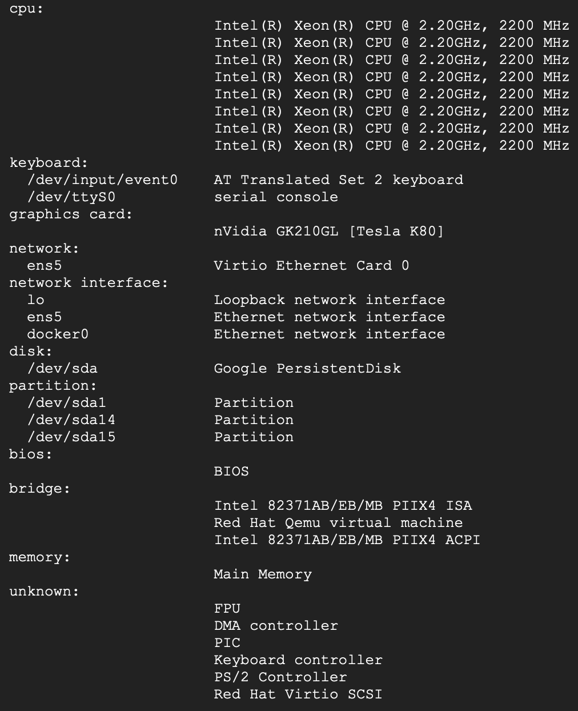
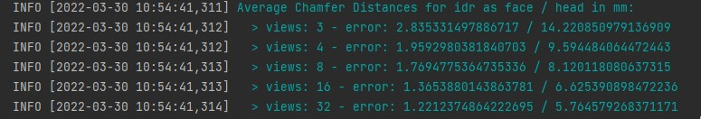
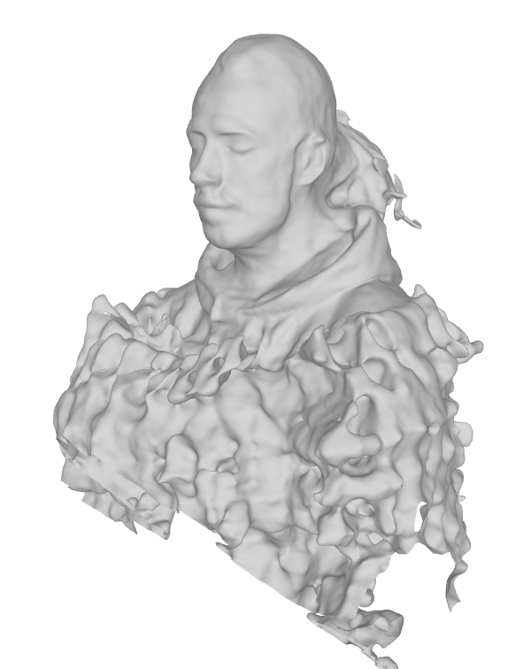
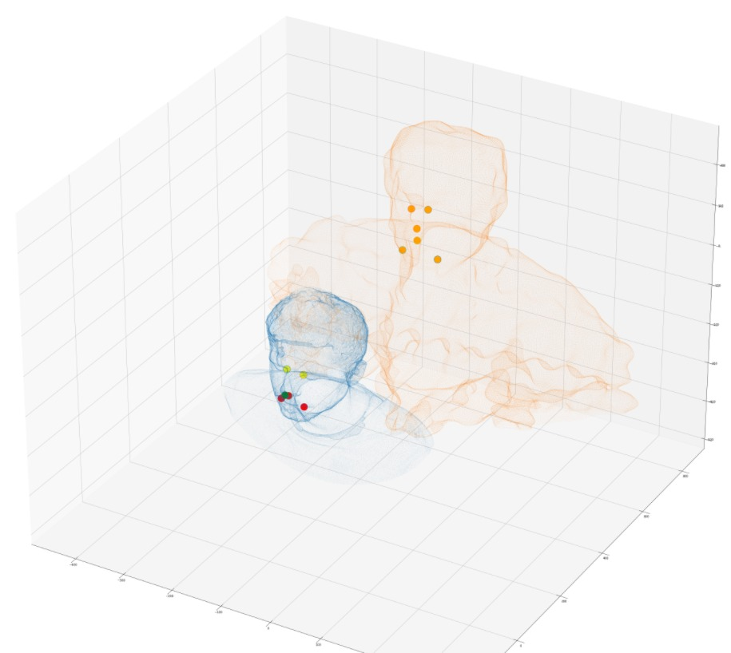

# H3D-Net-reproduction
The goal of this blog post is to present and describe our implementation to reproduce the deep learning paper “H3D-Net: Few-Shot High-Fidelity 3D Head Reconstruction” using Pytorch. We are doing this for an assignment of the course CS4240 Deep Learning (2021/22 Q3) at Delft University of Technology. This paper introduces a new high-fidelity full 3D head reconstruction method called H3D-Net that outperforms state-of-the-art models, such as MVFNet, DFNRMVS and IDR, in the few-shot (3 views) scenario. The H3D-Net utilizes both DeepSDF (a learned shape prior) and IDR (fine-tuning details) to achieve fast high-fidelity 3D face reconstruction from 2D images with different views. Please check the papers for more background information about DeepSDF and IDR. Our approach attempts to reproduce the results of the last two rows of "Table 2: 3D Reconstruction Method Comparison" of the paper.


1. Paper describing IDR method: https://lioryariv.github.io/idr/  
   - Repository for IDR method: https://github.com/lioryariv/idr
2. Paper describing DeepSDF method: https://paperswithcode.com/paper/deepsdf-learning-continuous-signed-distance  
   - Repository for DeepSDF method: 
3. Paper describing H3D-Net method: https://crisalixsa.github.io/h3d-net/  
   - Repository for H3D-Net method: Source code is not available, only the code used to manipulate the H3DS Dataset has been supplied: https://github.com/CrisalixSA/h3ds

## Reproducibility Approach

In order to reproduce the results from Table 2, we will first start by implementing the IDR method as described in Paper 1 using the H3DS dataset. We believe this will take a considereable amount of time to implement due to the large amount of training needed. Each scan_id (person's head) needs to be trained on for 3, 4, 8, 16, 32 views. The results from this implementation should give us the second last row of Table 2, [see results](#idr-results).
Once implemented we will move on to the DeepSDF method described in paper 2, followed by the actual H3D-Net implementation. 

One thing to note is that by the end of this reproducibility project we will have reimplemented methods described in 3 different papers, which is a condsidereable amount of work given the short amount of time allocated. (4-5 weeks). Total amount of training is 5 days and evaluation is 20 hours.  


## Google Cloud Platform
For cloud computing, we used a single deeplearning virtual machine instance with a Nvidia Tesla K80 GPU and a CPU with 30GB memory. A list of the specs of all the hardware from the virtual machine can be seen below. 



To make the GPU findable by the software, the following has to be done:
```
sudo su
nvidia-smi -pm 1
```
 
## IDR Method

The IDR method source code has been supplied and can be found in Repository 1, however it is taylored to the DTU dataset. So a few modiciations were needed in order to use the H3DS Dataset. 

First we cloned the repository of Paper 1 into the folder called `IDR` (as can be seen in our repository above). You can do this by calling the following:

```
git clone https://github.com/lioryariv/idr
```

The we need to create the idr evironment. (These instructions can be found in the `README.md` file of the `IDR` repository, but we will list it here to get you going)

```
conda env create -f environment.yml
conda activate idr
```

Now everything should be setup. 

### IDR Training

In order to start training the H3DS Dataset, we had to gain permission to use their H3DS dataset. After this, we manipulated their dataset 'h3ds_v0.2' to the correct format using `data_processing.py` which created a new dataset 'OWN_DATA' which is uded to create the conf file for each sample and all their views.

We cloned repository 3 in the `idr-main` folder of this repository.

```
git clone https://github.com/CrisalixSA/h3ds
```

Now we have a means of working with the H3DS Dataset.

#### Download the dataset
You can download the H3DS dataset from the H3DNet paper [this link](https://drive.google.com/file/d/1is1AByaMwaWJJN6CwQ4MmeqCHIMiijZw/view?usp=sharing).
Then, unzip the file using the `H3DS_ACCESS_TOKEN` as password. 

#### data_processing.py

`data_processing.py` uses the H3DS Dataset and organises the `images`, `masks` and `cameras.npz` files into different `views` (3, 4, 8, 16, 32). 

After running this python file, we are left with a folder called `OWN_DATA`, which contains folders with `view_ids`, which each contain all the `scan_id` folders, which each contain the respective `images`, `masks` and `cameras.npz` files for that scene. The data was split as shown in the `h3ds-main/h3ds/config.toml` file. This was done so that we could train different idr models when given different `views`.

#### H3D_fixed_cameras_X.conf

`H3D_fixed_cameras_X.conf` where `X` = `views` (3, 4, 8, 16, 32). These 5 files were added to `IDR/code/confs/` as the H3DS image resolution was different to the original `DTU Dataset` used in the idr paper 1. This file also redirects the training data to our `OWN_DATA`.

We are now ready to train on the different views. In order to train, we used the following code:

```
cd ./code
nohup python training/exp_runner.py --conf ./confs/H3D_fixed_cameras_X.conf --scan_id SCAN_ID &
```
Where `SCAN_ID` is the scan number shown within each `view_id`. The link between `scan_id` and `scene_id` can be found in `OWN_DATA/scan_list.txt`. 

Once finished training a specific view on a specific scene, we need to create the `surface_world_coordinates.ply` file generated by `/IDR/code/evaluation/eval.py`. The result will be saved in `IDR/evals/H3D_fixed_cameras_SCAN_ID/`. Be sure to change the name of `surface_world_coordinates.ply` to `surface_world_coordinates_VIEW_ID.ply` before running the training again, otherwise this file will be overwritten.

to generate this `surface_world_coordinates.ply`, run the following code in the terminal:

```
cd ./code
python evaluation/eval.py  --conf ./confs/H3D_fixed_cameras_X.conf --scan_id SCAN_ID
```

### IDR Results

<table>
   <tr>
      <th rowspan="2">Producer</th>
      <th colspan="2">View3</th>
      <th colspan="2">View4</th>
      <th colspan="2">View8</th>
      <th colspan="2">View16</th>
      <th colspan="2">View32</th>
   </tr>
   <tr>
      <th>face</th>
      <th>head</th>
      <th>face</th>
      <th>head</th>
      <th>face</th>
      <th>head</th>
      <th>face</th>
      <th>head</th>
      <th>face</th>
      <th>head</th>
   </tr>
   <tr>
      <td>Eduard</td>
      <td>3.52</td>
      <td>17.04</td>
      <td>2.14</td>
      <td>8.04</td>
      <td>1.95</td>
      <td>8.71</td>
      <td>1.43</td>
      <td>5.94</td>
      <td>1.39</td>
      <td>5.86</td>
   </tr>
   <tr>
      <td>Ours</td>
      <td>2.84</td>
      <td>14.22</td>
      <td>1.96</td>
      <td>9.59</td>
      <td>1.77</td>
      <td>8.12</td>
      <td>1.37</td>
      <td>6.63</td>
      <td>1.22</td>
      <td>5.76</td>
   </tr>
</table>




## Blunders we made on the run
- Training and evaluating should have been done in order (or otherwise use the timestamp). Each sample with all their views take around 2 hours which had to be done again for some of us.
- Use a 15GB GPU resulted in allocated memory issues and while we tried everything, a simple was to use a 30GB GPU. 
- In manipulating the data we made an erorr assigning the correct name of the images (e.g. img_0001 --> img_0010 not img_00010). We had to generate the data all again and some had to do training over as well.


